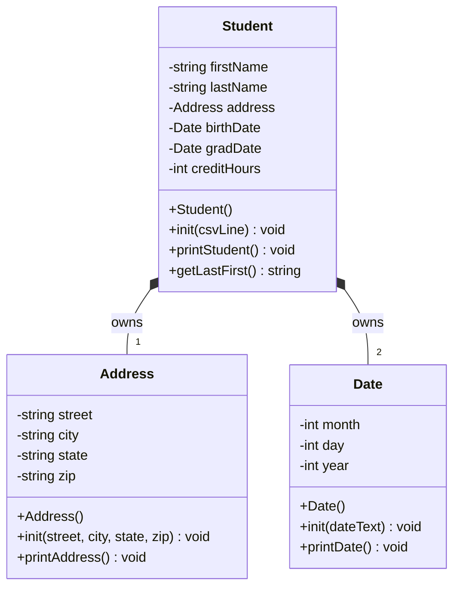

# Student Data UML

```mermaid
classDiagram
    class Address {
      -string street
      -string city
      -string state
      -string zip
      +Address()
      +init(street, city, state, zip) void
      +printAddress() void
    }
    class Date {
      -int month
      -int day
      -int year
      +Date()
      +init(dateText) void
      +printDate() void
    }
    class Student {
      -string firstName
      -string lastName
      -Address address
      -Date birthDate
      -Date gradDate
      -int creditHours
      +Student()
      +init(csvLine) void
      +printStudent() void
      +getLastFirst() string
    }
    Student *-- "1" Address : owns
    Student *-- "2" Date : owns
```
